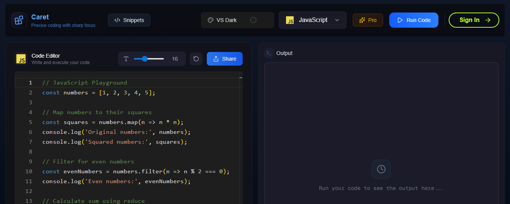
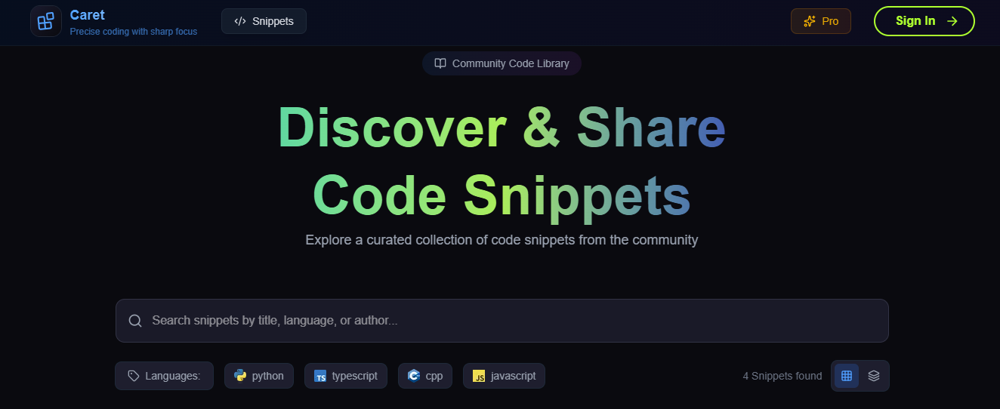
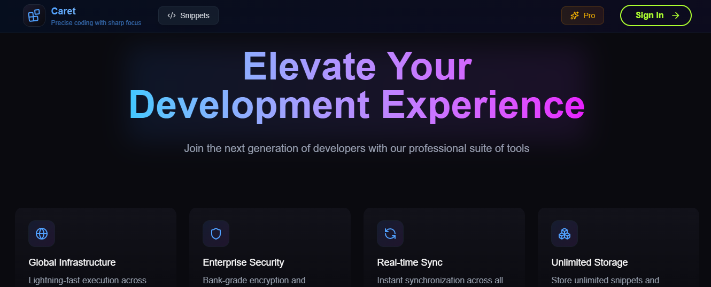

# ✨ Caret – The Modern Code Editor for the Web

<h3>Caret is a sleek, full-stack web-based code editor designed for speed, collaboration, and learning.  
With built-in support for multiple programming languages, real-time snippet sharing, and seamless execution, Caret makes writing and running code online effortless. 🚀</h3>


# 🌟 Features

- 🖊 **Powerful Editor Panel** – Syntax highlighting, themes, and responsive UI.  
- ⚡ **Run Code Instantly** – Execute snippets in multiple languages (Python, JavaScript, C, Go, Rust, Java, and more).  
- 📚 **Snippet Management** – Save, share, and revisit code snippets with ease.  
- 💬 **Comments & Collaboration** – Discuss snippets directly with inline comments.
- 👤 **Profiles & Auth** – Personalized experience with user profiles and authentication.  
- 💎 **Pro Features** – Upgrade for enhanced functionality with a clean pricing page.  

&nbsp;

# 🖥️ Tech Stack

- **Frontend**: [Next.js](https://nextjs.org/), React, TypeScript  
- **Backend**: [Convex](https://convex.dev) for serverless functions & real-time data  
- **Styling**: TailwindCSS + custom CSS modules  
- **Auth**: [Clerk](https://clerk.com) for easy authentication setup & management  
- **Code Execution**: API routes with sandboxed execution  
- **Deployment**: Optimized for [Vercel](https://vercel.com)  

&nbsp;

# 📂 Project Structure

```bash
├── .gitignore
├── LICENSE
├── README.md
├── convex
    ├── README.md
    ├── _generated
    │   ├── api.d.ts
    │   ├── api.js
    │   ├── dataModel.d.ts
    │   ├── server.d.ts
    │   └── server.js
    ├── auth.config.ts
    ├── codeExecutions.ts
    ├── http.ts
    ├── schema.ts
    ├── snippets.ts
    ├── tsconfig.json
    └── users.ts
├── eslint.config.mjs
├── next.config.ts
├── package-lock.json
├── package.json
├── postcss.config.mjs
├── public
    ├── bash.png
    ├── c.png
    ├── cpp.png
    ├── csharp.png
    ├── go.png
    ├── java.png
    ├── javascript.png
    ├── js.png
    ├── python.png
    ├── ruby.png
    ├── rust.png
    ├── swift.png
    ├── ts.png
    ├── typescript.png
    └── vercel.svg
├── src
    ├── app
    │   ├── (root)
    │   │   ├── _components
    │   │   │   ├── EditorPanel.tsx
    │   │   │   ├── EditorViewSkeleton.tsx
    │   │   │   ├── Header.tsx
    │   │   │   ├── HeaderProfileButton.tsx
    │   │   │   ├── LanguageSelector.tsx
    │   │   │   ├── OutputPanel.tsx
    │   │   │   ├── RunButton.tsx
    │   │   │   ├── RunningCodeSkeleton.tsx
    │   │   │   ├── ShareSnippetDialog.tsx
    │   │   │   └── ThemeSelector.tsx
    │   │   ├── _constants
    │   │   │   └── index.ts
    │   │   └── page.tsx
    │   ├── favicon.ico
    │   ├── globals.css
    │   ├── layout.tsx
    │   ├── pages
    │   │   └── api
    │   │   │   └── execute.ts
    │   ├── pricing
    │   │   ├── _components
    │   │   │   ├── FeatureCategory.tsx
    │   │   │   ├── FeatureItem.tsx
    │   │   │   ├── ProPlanView.tsx
    │   │   │   └── UpgradeButton.tsx
    │   │   ├── _constants
    │   │   │   └── index.ts
    │   │   └── page.tsx
    │   ├── profile
    │   │   ├── _components
    │   │   │   ├── CodeBlock.tsx
    │   │   │   ├── ProfileHeader.tsx
    │   │   │   └── ProfileHeaderSkeleton.tsx
    │   │   └── page.tsx
    │   └── snippets
    │   │   ├── [id]
    │   │       ├── _components
    │   │       │   ├── CodeBlock.tsx
    │   │       │   ├── Comment.tsx
    │   │       │   ├── CommentContent.tsx
    │   │       │   ├── CommentForm.tsx
    │   │       │   ├── Comments.tsx
    │   │       │   ├── CopyButton.tsx
    │   │       │   ├── SnippetLoadingSkeleton.tsx
    │   │       │   └── TipTap.tsx
    │   │       └── page.tsx
    │   │   ├── _components
    │   │       ├── DeleteDialogCard.tsx
    │   │       ├── DeleteModal.tsx
    │   │       ├── SnippetCard.tsx
    │   │       └── SnippetsPageSkeleton.tsx
    │   │   └── page.tsx
    ├── components
    │   ├── Footer.tsx
    │   ├── LoginButton.tsx
    │   ├── NavigationHeader.tsx
    │   ├── StarButton.tsx
    │   └── providers
    │   │   └── ConvexClientProvider.tsx
    ├── hooks
    │   └── useMounted.tsx
    ├── middleware.ts
    ├── store
    │   └── useCodeEditorStore.ts
    ├── styles
    │   ├── DeleteDialogCard.css
    │   └── ModernButton.css
    ├── types
    │   └── index.ts
    └── utils
    │   └── ModernButton.tsx
└── tsconfig.json
```

&nbsp;

# 🚀 Getting Started

### Prerequisites
- Node.js **>=18**
- pnpm / npm / yarn (package manager)

&nbsp;
# Installation

### Clone the repository:
```bash
git clone https://github.com/your-/caret.git
cd caret
```
### Install dependencies:
```bash
npm install
# or
yarn install
# or
pnpm install
```
&nbsp;

# 🌐 Supported Languages

### Caret comes with built-in execution support for:

- Python 🐍
- JavaScript / TypeScript ⚡
- C / C++ ⚙️
- Java ☕
- Go 🐹
- Rust 🦀
- Swift 🍏
- Ruby 💎
- C# 🎯
- Bash 🖥
---
&nbsp;

# 📸 Snapshots

- Home Page


- Snippets Page


- Pricing Page

---
&nbsp;

# 📜 License

### This project is licensed under the MIT License.

&nbsp;

# 🤝 Contributing

Contributions, issues, and feature requests are welcome!
Feel free to fork the repo and open a PR.